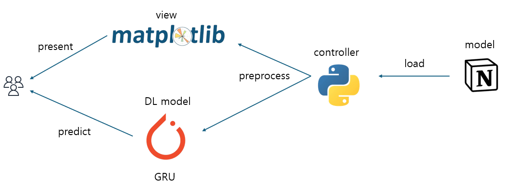
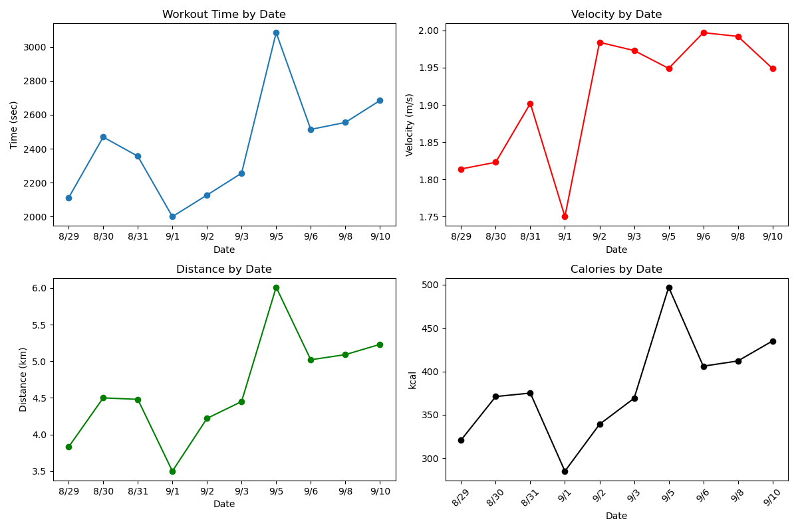

# Runner and Learner
러닝 데이터를 전처리 후  
AI 모델이 다음 데이터를 예측하며 그래프로 퍼포먼스 변화를 관찰합니다.

###### 러닝 일지
https://velog.io/@hwangrock1220/series/%EC%9A%B4%EB%8F%99%EB%9F%B0%EB%8B%9D

---

### 개발 배경

Apple의 피트니스 앱은 운동 기록을 체계적으로 관리하고 주요 지표를 제공하지만,  
여러 날의 데이터를 한눈에 비교하거나 성장 추이를 직관적으로 확인하기에는 한계가 있었습니다.  
 
단순한 수치 나열이 아니라 날짜에 따른 퍼포먼스 변화를 그래프로 시각화하면
사용자가 자신의 성장 곡선을 더 쉽게 파악하고,  
목표 설정에도 큰 도움이 될 것이라 생각했습니다.

---

### 기술적 성과

- 코루틴 기반 Python FastAPI 최적화
- 데이터 분석을 통한 의사수립

---

### 설계 - MVC 패턴

###### 그래프 예시

