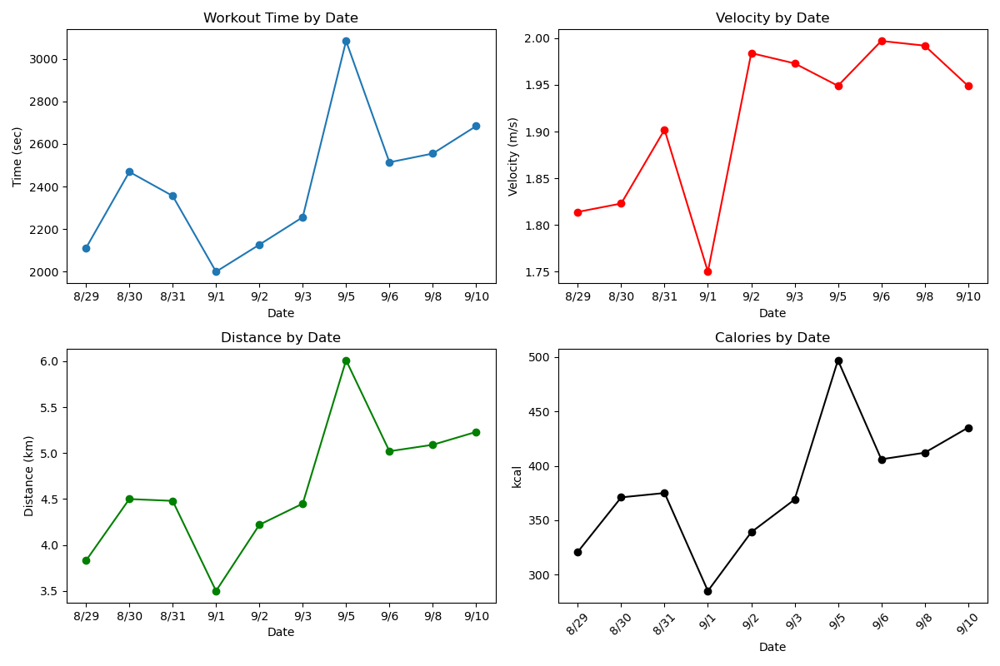

# Runner and Learner
러닝 데이터를 전처리 후  
AI 모델이 다음 데이터를 예측하며 그래프로 퍼포먼스 변화를 관찰합니다.

###### 러닝 일지
https://velog.io/@hwangrock1220/series/%EC%9A%B4%EB%8F%99%EB%9F%B0%EB%8B%9D

---

### 개발 배경

###### 운동
Apple의 피트니스 앱은 운동 기록을 체계적으로 관리하고 주요 지표를 제공하지만,  
여러 날의 데이터를 한눈에 비교하거나 성장 추이를 직관적으로 확인하기에는 한계가 있었습니다.  
 
단순한 수치 나열이 아니라 날짜에 따른 퍼포먼스 변화를 그래프로 시각화하면
사용자가 자신의 성장 곡선을 더 쉽게 파악하고,  
목표 설정에도 큰 도움이 될 것이라 생각했습니다.

###### 성장과 목표
거대한 목표를 잡고 성장하기 위해서는 한번에 큰 목표를 잡는 것보다는  
가까운 목표부터 잡고 목표를 이루며 점차 목표를 키우는 것이 좋다고 생각하고 있습니다.  
 
하지만, 목표를 잡는 기준이 되게 애매하다는 문제가 있었습니다.  
이를 위해서 AI가 과거의 데이터를 보고 다음 목표를 잡아주는 것으로 설정했습니다.  
 
이를 통해 AI는 데이터가 점차 쌓이면서 더 좋은 목표를 잡아주게 되고,  
사람은 목표를 이루며 성장과 성취감을 느끼게 됩니다.

###### 기술
직접 시계열 데이터를 수집하고  
시계열 데이터를 추론하는데 쓰이는 vanila RNN, LSTM, GRU의 퍼포먼스 차이를  
한번 몸소 실험해보고 싶었습니다.

---

### 설계 - MVC 패턴

###### 그래프 예시

---

### After
현재 파이썬을 서버로 배포하고  
react native나 swift로 프론트엔드로 빌드해서  
app 플랫폼으로 사용