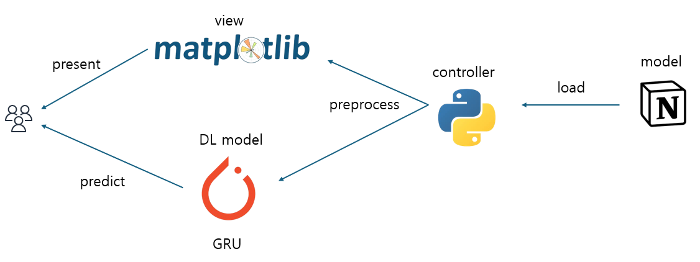

# running
러닝 데이터를 전처리 후 그래프로 퍼포먼스 변화를 관찰합니다.

###### 러닝 일지
https://velog.io/@hwangrock1220/series/%EC%9A%B4%EB%8F%99%EB%9F%B0%EB%8B%9D

---

### 설계 - MVC 패턴

###### 그래프 예시

---

### After
일정 데이터 모이면 RNN으로 학습시키고  
다음의 데이터를 예측하고  
예측을 이겨보는 도전  